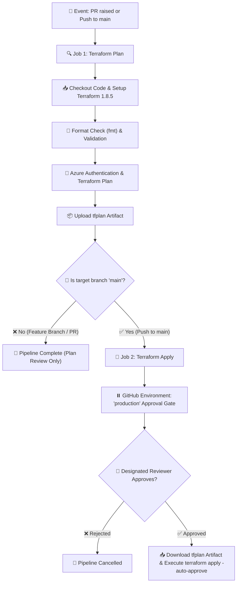

# ☁️ Azure Infrastructure Automation with Terraform & GitHub Actions 🚀

> **A production-ready Infrastructure-as-Code (IaC) repository provisioning Azure Cloud Infrastructure dynamically using Terraform `for_each` maps, integrated with a single unified GitHub Actions CI/CD Pipeline featuring automated Plan validation and Environment Manual Approval gating.** 🛡️

---

## 🌟 Badges


---

## 🏗️ Architecture Overview

This project dynamically provisions and manages multi-tier Azure infrastructure components driven entirely by data maps in `terraform.tfvars`:

* 📦 **Resource Groups** ([rg.tf](file:///rg.tf)) — Logical containers for managing access control, tags, and lifecycles (`azurerm_resource_group`).
* 🌐 **Virtual Networks & Subnets** ([network.tf](file:///network.tf)) — Isolated network topology including `frontend_snet`, `backend_snet`, and `AzureBastionSubnet` (`azurerm_virtual_network`, `azurerm_subnet`).
* 🖥️ **Linux Virtual Machines** ([vm.tf](file:///vm.tf)) — Ubuntu 22.04 LTS Compute instances configured with dedicated Network Interface Cards (`azurerm_linux_virtual_machine`, `azurerm_network_interface`).
* 🏰 **Azure Bastion Host** ([bastion.tf](file:///bastion.tf)) — Fully managed PaaS Bastion host with Public IP allocation for secure SSH/RDP connectivity without exposed public ports (`azurerm_bastion_host`, `azurerm_public_ip`).

---

## 📁 Repository Directory Structure

```text
📂 terraform-azure-from-scratch/
│
├── 📂 .github/
│   └── 📂 workflows/
│       └── 📄 terraform.yml       # ⚡ Unified CI/CD Pipeline (Plan + Manual Approval + Apply)
│
├── 📄 bastion.tf                 # 🏰 Azure Bastion Host & Public IP definitions
├── 📄 network.tf                 # 🌐 Virtual Network (VNet) & Subnet definitions
├── 📄 rg.tf                      # 📦 Azure Resource Group definitions
├── 📄 vm.tf                      # 🖥️ Linux Virtual Machine & NIC definitions
├── 📄 provider.tf                # 🔌 AzureRM Provider setup
├── 📄 version.tf                 # 📌 Terraform engine, providers & Remote Azure Blob Backend
├── 📄 variable.tf                # 📥 Terraform input variable declarations
├── 📄 output.tf                  # 📤 Terraform output value exports
├── 📄 terraform.tfvars           # ⚙️ Infrastructure parameter values & map objects
└── 📄 README.md                  # 📖 Comprehensive repository documentation
```

---

## ⚡ Unified CI/CD Pipeline Workflow (`terraform.yml`)

The repository operates on a **single, unified GitHub Actions workflow** ([.github/workflows/terraform.yml](file:///.github/workflows/terraform.yml)) that manages both validation for feature branches and deployment for the `main` branch.

### 🔄 Pipeline Execution Workflow



---

## 🎭 Pipeline Stages Breakdown

### 1️⃣ **Plan Stage (`plan`)** 🔍
* 🌿 **Triggers**: On `pull_request` (feature branches targeting `main`) and `push` to `main`.
* 📋 **Actions**:
  * 🎨 **Format Check**: Executes `terraform fmt -check -recursive`.
  * 🔐 **Azure Authentication**: Securely authenticates using Azure Service Principal credentials stored in GitHub Secrets.
  * 🔍 **Validation & Planning**: Runs `terraform init`, `terraform validate`, and `terraform plan -out=tfplan`.
  * 📦 **Artifact Export**: Uploads the generated `tfplan` binary as a workflow artifact.
* 💡 **Feature Branch Logic**: For feature branch PRs, execution ends here so team members can inspect planned changes before merging.

### 2️⃣ **Apply Stage (`apply`)** 🚀
* 🌿 **Triggers**: Executed **ONLY** when code is pushed or merged into the `main` branch.
* ⏸️ **Manual Approval Gate**: Uses GitHub Actions `environment: production`. Execution automatically pauses and notifies designated reviewers for explicit approval.
* 📋 **Actions**:
  * 📥 **Fetch Artifact**: Downloads the exact `tfplan` generated during the Plan stage.
  * 🎯 **Execution**: Runs `terraform apply -auto-approve tfplan` to guarantee exact infrastructure state alignment without unexpected drift.

---

## 🔒 Security & Environment Setup

> [!IMPORTANT]
> ### 1. 🔑 Configure GitHub Repository Secrets
> Navigate to **Settings** ➔ **Secrets and variables** ➔ **Actions** in your GitHub repository and add the following secret credentials:
>
> | Secret Name | Description |
> | :--- | :--- |
> | `AZURE_CLIENT_ID` 🆔 | Azure Service Principal Application (Client) ID |
> | `AZURE_CLIENT_SECRET` 🔑 | Azure Service Principal Password/Secret |
> | `AZURE_SUBSCRIPTION_ID` 💳 | Azure Target Subscription GUID |
> | `AZURE_TENANT_ID` 🏢 | Azure Active Directory Tenant GUID |

> [!TIP]
> ### 2. 🛡️ Configure Required Reviewer Manual Approval
> To enforce reviewer authorization before infrastructure changes apply to production:
>
> 1. Go to your repository on **GitHub.com**.
> 2. Click **Settings** ➔ **Environments** ➔ **New environment**.
> 3. Name the environment: `production`.
> 4. Under **Environment protection rules**, check **Required reviewers**.
> 5. Add the designated reviewers/teams who must approve production deployments.
> 6. Save the rule.

---

## 💻 Local Development Guide

### 🛠️ Prerequisites
* 🟦 [Azure CLI](https://docs.microsoft.com/en-us/cli/azure/install-azure-cli) (`az login`)
* 💜 [Terraform CLI](https://developer.hashicorp.com/terraform/downloads) (`v1.8.5+`)

### 🏃 Quick Start Commands

```bash
# 1. 📥 Clone Repository
git clone https://github.com/your-username/terraform-azure-from-scratch.git
cd terraform-azure-from-scratch

# 2. 🔌 Initialize Terraform & Download Provider Plugins
terraform init

# 3. 🎨 Check Code Formatting
terraform fmt -check -recursive

# 4. ✅ Validate Configuration Syntax
terraform validate

# 5. 🔍 Preview Planned Infrastructure Changes
terraform plan

# 6. 🚀 Apply Changes to Azure
terraform apply
```

---

## 🤝 Contributing & Workflow Best Practices

1. 🌿 **Branch Naming**: Create feature branches following the `feature/your-feature-name` convention.
2. 📝 **PR Validation**: Raising a Pull Request automatically triggers the **Terraform Plan** stage to verify syntax and display resource diffs.
3. 👤 **Code Review**: At least one team member must review the PR code and Terraform plan artifact.
4. 🚀 **Deployment**: Merging into `main` automatically triggers the **Terraform Apply** approval request.

---

<p center>
  Made with ❤️ & ☁️ for Azure Infrastructure Automation
</p>
